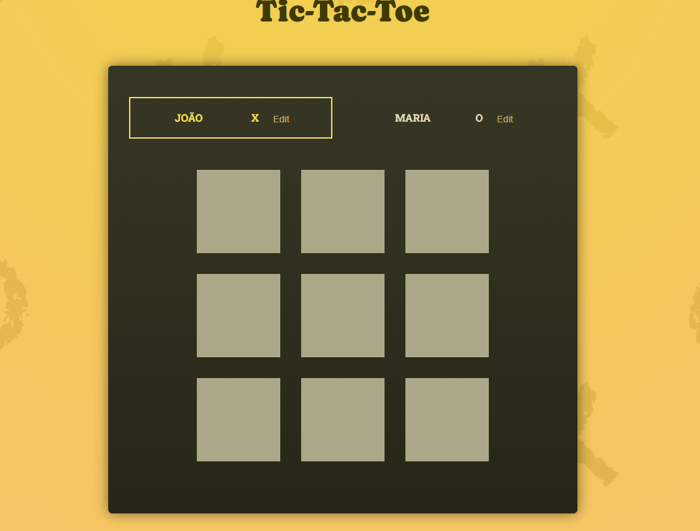
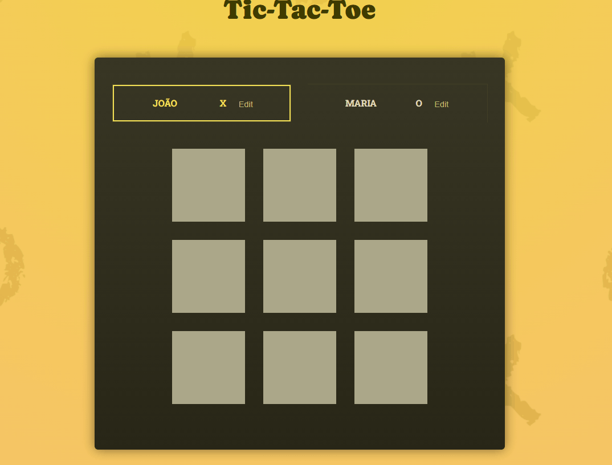

<div align="center">
  <h1> Tic Tac Toe - Jogo da velha</h1>
</div>

<p align="center">
  Este projeto é uma implementação do clássico jogo da velha utilizando React,
  uma biblioteca JavaScript popular para a criação de interfaces de usuário.
</p>

<p align="center">
  <a href="#features">Features</a> •
  <a href="#pré-requisitos">Pré requisitos</a> •  
  <a href="#rodando-a-aplicação">Rodando a aplicação</a> •
  <a href="#tecnologias">Tecnologias</a> •
  <a href="#autor">Autor</a>
</p>

---

<br>

# Demonstração do projeto

<!-- Ver uns botoes para colocar aqui -->

<a href="https://greatwhoone.github.io/tic-tac-toe/">
🚀 LINK
</a>

# Features

- [x] Interface Simples e Intuitiva: Uma interface de usuário limpa, fácil de entender e interagir.
- [x] Modo de Jogo para Dois Jogadores: Suporte para dois jogadores locais, alternando entre 'X' e 'O'.
- [x] Detecção de Vitória e Empate: Verificação automática de vitória ou empate com destaque visual para o vencedor.
- [x] Inserção de Nomes dos Jogadores: Possibilidade de personalizar os nomes dos jogadores antes de iniciar a partida.
- [x] Histórico de Jogadas: Visualização do histórico das jogadas feitas durante a partida.

<h1 align="center">
  
  
  

</h1>

# Pré requisitos

Você vai ter que ter instalado na sua máquina as seguintes ferramentas:

- [GIT](https://git-scm.com/)
- [Node.js](https://nodejs.org)

Recomendo a utilização do [VS Code](https://code.visualstudio.com/) para editar o código.

# Rodando a aplicação

```bash
# Clone o repositório
git clone https://github.com/GreatWhoOne/tic-tac-toe.git

# Entre na pasta do projeto
cd .\tic-tac-toe\

# Instale as dependências
npm install

# Rode a aplicação
npm run dev

# O servidor iniciará na porta: 5173 - acesse <http://localhost:5173>
```

# Tecnologias

- [React](https://react.dev/)
- CSS

# Autor

Feitor por Juan 🙋🏾 - [Veja meu LinkedIn](https://www.linkedin.com/in/juan-cruz-pereira/)
